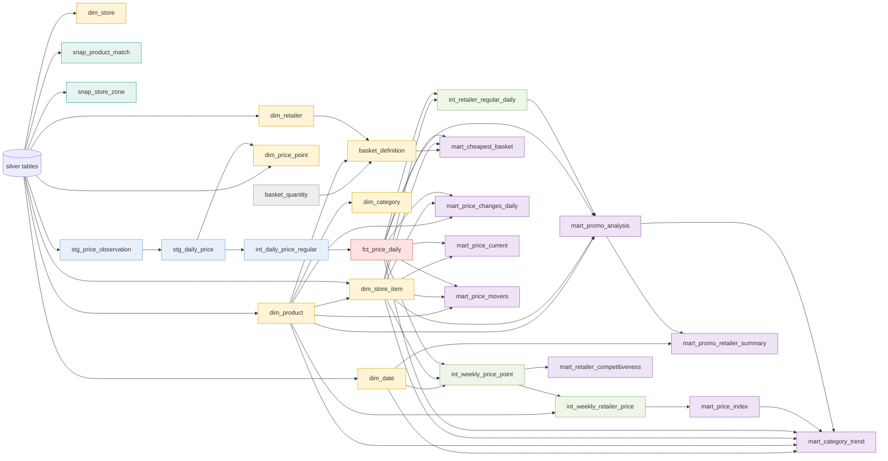

# Warehouse (dbt) reference

The gold layer is a dbt project in `warehouse/`. Silver tables are declared as sources (`models/staging/sources.yml`); staging models are views, intermediate and mart models are tables, and `fct_price_daily` is incremental.

## Lineage

## Models

| Model | Kind | Grain | Purpose |
|---|---|---|---|
| `stg_price_observation` | view | observation | resolves each observation to a price point (`retailer:zone`) |
| `stg_daily_price` | view | item x price point x day | collapses the stores of a zone with `mode()` |
| `int_daily_price_regular` | view | item x price point x day | adds the regular price (last ordinary price observed) |
| `fct_price_daily` | incremental | item x price point x day | the fact: integer qepik prices, promo flag, observation time |
| `dim_date`, `dim_retailer`, `dim_price_point`, `dim_store`, `dim_category` | table | one row per member | dimensions; `dim_price_point.requires_zone_choice` carries the zone rule |
| `dim_product` | table | canonical product | published products only (quarantined excluded) |
| `dim_store_item` | table | retailer SKU | bridge SKU to product; keeps facts independent of re-matching |
| `mart_price_current` | table | product x price point | latest observation with its time |
| `mart_price_index` | table | week x category | fixed-base matched-model Jevons index |
| `mart_retailer_competitiveness` | table | week x price point | price index vs market and share cheapest |
| `mart_promo_analysis` | table | promotion price-day | claimed versus market-based discount, inflated and fake flags |
| `mart_promo_retailer_summary`, `mart_category_trend` | table | week x retailer / category | rollups |
| `mart_price_changes_daily`, `mart_price_movers` | table | day x retailer x category / product x retailer | price moves |
| `basket_definition`, `mart_cheapest_basket` | table | product / day x price point | default basket and its daily cost |
| `snap_product_match`, `snap_store_zone` | snapshot | SKU / store | SCD2 history of match decisions and measured zones |

Formulas: [`METHODOLOGY.md`](METHODOLOGY.md). Tests: 62 (see `warehouse/models/marts/schema.yml` and `warehouse/tests/`). Generate the browsable docs site with `make dbt-docs`.
